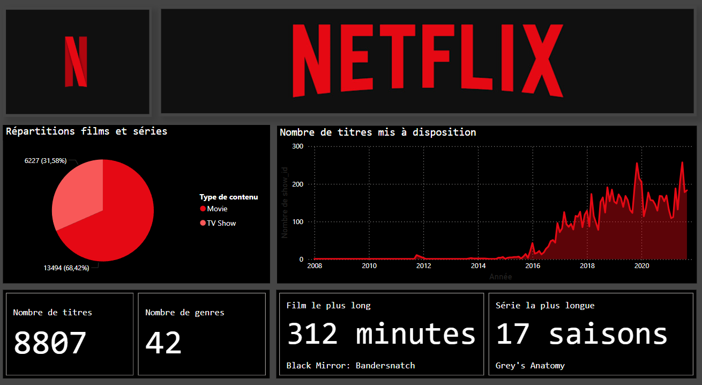

# Netflix

The goal of this project is to use the dataset [Netflix titles](netflix_titles.csv) and to create a dashboard, answering the following questions: 

- Identify which genres are the most present on the platform
- Identify in how many countries Netflix is available
- Identify which country has the most content
- Identify dominant genre per country
- ...

